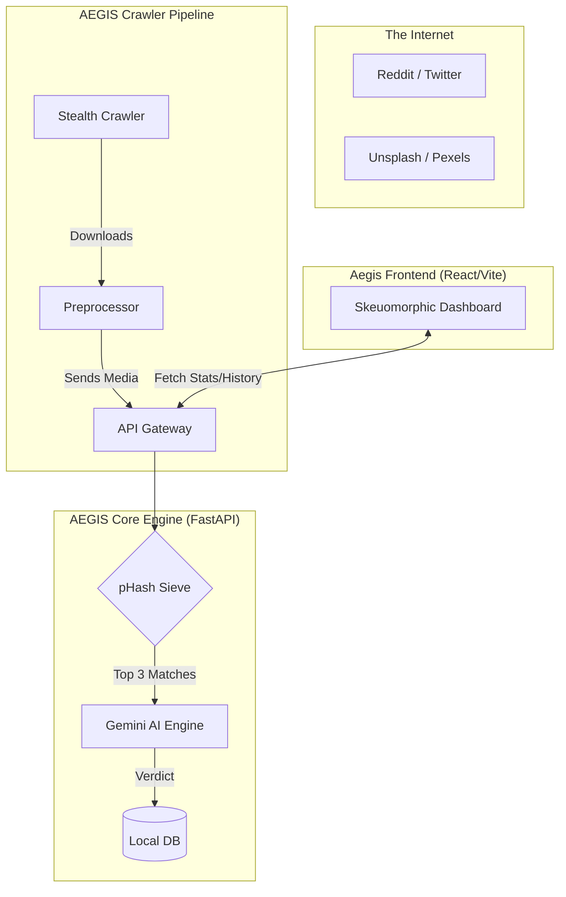

# 🛡️ AEGIS — Digital Asset Protection Suite

**AEGIS** is an autonomous media protection engine designed to defend digital assets (images/video) from unauthorized modification and redistribution across social media. 

Using a **Two-Stage Sieve Architecture**, it combines high-speed perceptual hashing (pHash) with the semantic power of **Gemini 2.5 Flash** to detect infringements even when they are cropped, filtered, or watermarked.

---

## 🚀 Key Features

-   **Autonomous Crawling**: Stealth Playwright-based monitors for Reddit and Twitter (X), plus stock API integration (Unsplash, Pexels, Pixabay).
-   **Semantic Detection**: Powered by Gemini Multimodal AI to understand *context*—detecting a match even if the lighting or angle has changed.
-   **Two-Stage Sieve**: Pre-filters thousands of assets using local pHash math to save 90% on API costs and increase speed by 10x.
-   **Skeuomorphic Dashboard**: A premium, high-fidelity React dashboard to monitor threat levels, manage your asset library, and export legal reports.
-   **Automated Forensics**: Generates detailed AI reasoning for every match, identifying specific modifications (cropping, removals, etc.).

---

## 🏗️ Architecture



---

## 🛠️ Setup Guide

### 1. Prerequisites
-   Python 3.9+
-   Node.js 18+
-   Google Gemini API Key ([Get it here](https://aistudio.google.com/))

### 2. Installation
Clone the repository and run the setup for each component:

#### Core Engine
```bash
cd engine
pip install -r requirements.txt
cp .env.example .env # Add your Gemini API Key
uvicorn main:app --reload
```

#### Crawler Pipeline
```bash
cd crawler_pipeline
pip install -e .
playwright install chromium
cp .env.example .env
python main.py --source social --keywords "sports" --limit 5
```

#### Frontend
```bash
cd frontend
npm install
npm run dev
```

---

## 🛡️ The "Two-Stage Sieve" Concept

Unlike naive detection systems, AEGIS does not send every image to the cloud. 
1.  **Stage 1 (Local)**: The engine computes a 64-bit perceptual fingerprint for the suspicious image and compares it against your library using Hamming distance.
2.  **Stage 2 (Cloud)**: Only the top 3 "High Probability" candidates are sent to Gemini for final semantic verification.

This ensures **Enterprise scalability** with **Minimum API cost**.

---

## 📄 License
MIT License - Copyright (c) 2026
