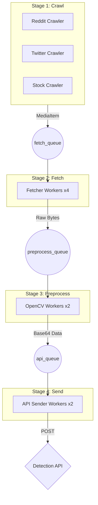
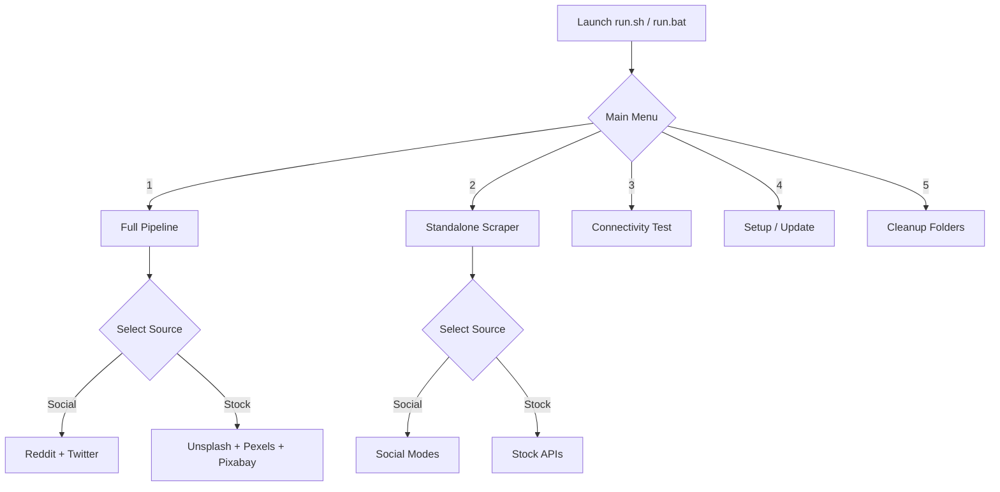
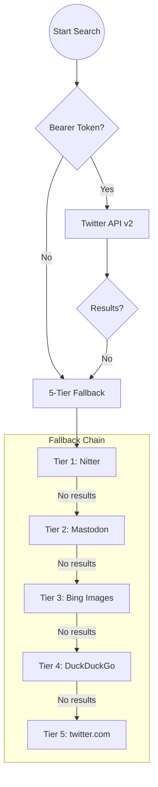

# 🛡️ Digital Asset Protection — Crawler & Data Pipeline

> **Scraper component** of the Digital Asset Protection system.  
> Crawls Reddit, Twitter/X, Unsplash, Pexels, and Pixabay for media matching configured keywords,
> preprocesses it, and forwards it to the Detection API for analysis.

---

## Table of Contents

- [System Overview](#system-overview)
- [Architecture](#architecture)
- [Project Structure](#project-structure)
- [Prerequisites](#prerequisites)
- [Installation](#installation)
- [Configuration](#configuration)
  - [`.env` Reference](#env-reference)
- [Running the Pipeline](#running-the-pipeline)
  - [Via Launcher (Recommended)](#via-launcher-recommended)
  - [Via CLI](#via-cli)
  - [Connectivity Test](#connectivity-test)
  - [Full Pipeline](#full-pipeline)
  - [Standalone Mode](#standalone-mode)
    - [Social Scraper (Reddit + Twitter)](#social-scraper-reddit--twitter)
    - [Stock Scraper (Unsplash / Pexels / Pixabay)](#stock-scraper-unsplash--pexels--pixabay)
- [Module Documentation](#module-documentation)
  - [config.py](#configpy)
  - [utils.py](#utilspy)
  - [crawler.py](#crawlerpy)
  - [fetcher.py](#fetcherpy)
  - [preprocessor.py](#preprocessorpy)
  - [pipeline.py](#pipelinepy)
  - [standalone.py](#standalonepy)
  - [stock_scraper.py](#stock_scraperpy)
- [Data Flow](#data-flow)
- [Crawler Strategy](#crawler-strategy)
  - [Reddit](#reddit)
  - [Twitter / X](#twitter--x)
- [Duplicate Detection](#duplicate-detection)
- [Image Filtering](#image-filtering)
- [Media Processing](#media-processing)
- [Detection API Integration](#detection-api-integration)
- [Logging](#logging)
- [Scaling to Redis](#scaling-to-redis)
- [Troubleshooting](#troubleshooting)

---

## System Overview

```
┌─────────────────────────────────────────────────────────┐
│                   Digital Asset Protection              │
│                                                         │
│   ┌──────────┐    ┌──────────────┐    ┌─────────────┐  │
│   │ scraper  │───▶│    model     │───▶│    dash     │  │
│   │ Crawler  │    │ Detection   │    │  Storage &  │  │
│   │ Pipeline │    │    API      │    │  Dashboard  │  │
│   └──────────┘    └──────────────┘    └─────────────┘  │
└─────────────────────────────────────────────────────────┘
```

This repository is **scraper** — the crawler and data pipeline. It:
1. Crawls Reddit and Twitter/X for posts matching your keywords, downloading images to `suspicious/`.
2. Crawls Unsplash, Pexels, and Pixabay for reference images via their free APIs, saving to `assets/`.
3. Preprocesses media using OpenCV (resize, normalize, frame extraction).
4. Sends processed media + metadata to the Detection API at `http://localhost:8000/match`.
5. Logs match results and similarity scores.

---

## Architecture

The system uses a **Producer-Consumer** architecture based on `asyncio.Queue`. This allows the crawlers (producers) to keep running even if the downstream workers (consumers) are temporarily busy.



All stages run concurrently. If a queue fills up, the previous stage pauses automatically to prevent memory overflow.

---

## Project Structure

```
crawler_pipeline/
├── quicklaunch/
│   ├── run.sh              # Linux interactive launcher (activates venv automatically)
│   └── run.bat             # Windows interactive launcher (activates venv automatically)
├── src/
│   └── crawler_pipeline/
│       ├── __init__.py
│       ├── config.py           # All config, reads from .env
│       ├── utils.py            # Logging, SeenCache, MediaItem, retry decorator
│       ├── crawler.py          # Reddit + Twitter crawlers (API + Playwright fallback)
│       ├── fetcher.py          # Async media downloader
│       ├── preprocessor.py     # OpenCV image/video processing
│       ├── pipeline.py         # Main orchestrator
│       ├── standalone.py       # Social scraper: Reddit + Twitter → suspicious/
│       └── stock_scraper.py    # Stock scraper: Unsplash / Pexels / Pixabay → assets/
├── tests/
│   ├── __init__.py
│   └── test_utils.py
├── suspicious/                 # Auto-created; social images + manifest.json
├── assets/                     # Auto-created; stock site images + stock_manifest.json
├── logs/                       # Auto-created; timestamped log files
├── venv/                       # Virtual environment (auto-created by Setup option)
├── .env                        # Your secrets (never commit!)
├── .env.example                # Template
├── targets.json                # Top-mode targets (subreddits + X accounts)
├── main.py                     # CLI entry point
├── pyproject.toml
└── requirements.txt
```

---

## Prerequisites

| Requirement | Version | Notes |
|---|---|---|
| Python | ≥ 3.11 | Uses `asyncio`, `dataclasses`, type annotations |
| pip | latest | `python -m pip install --upgrade pip` |
| Reddit API App | — | Optional — [Create here](https://www.reddit.com/prefs/apps) |
| Twitter Dev Account | — | Optional — [Create here](https://developer.twitter.com/) |
| Playwright Browsers | — | Installed separately (see below) |
| Unsplash API key | — | Free — [developers.unsplash.com](https://unsplash.com/developers) |
| Pexels API key | — | Free — [pexels.com/api](https://www.pexels.com/api/) |
| Pixabay API key | — | Free — [pixabay.com/api/docs](https://pixabay.com/api/docs/) |

---

## Installation

```bash
# 1. Create virtual environment
python -m venv venv
source venv/bin/activate        # Windows: venv\Scripts\activate

# 2. Install Python dependencies
pip install -r requirements.txt
# OR editable install for development:
pip install -e .

# 3. Install Playwright browser binaries
playwright install chromium

# 4. Set up environment file
cp .env.example .env            # Windows: copy .env.example .env
# Edit .env and fill in your credentials
```

> **Tip**: Steps 1–3 are handled automatically by the **Setup** option (menu item 5)
> in `quicklaunch/run.sh` / `quicklaunch/run.bat`.

---

## Configuration

All configuration is done via the `.env` file. **Never commit `.env` to version control** — it is already in `.gitignore`.

### `.env` Reference

#### Reddit API

Get from [reddit.com/prefs/apps](https://www.reddit.com/prefs/apps) → Create App → select **script**.

| Variable | Required | Default | Description |
|---|---|---|---|
| `REDDIT_CLIENT_ID` | For API | — | App client ID (under app name) |
| `REDDIT_CLIENT_SECRET` | For API | — | App secret |
| `REDDIT_USERNAME` | For API | — | Your Reddit username |
| `REDDIT_PASSWORD` | For API | — | Your Reddit password |
| `REDDIT_USER_AGENT` | No | `DigitalAssetProtection/1.0` | Bot identifier |

> **Fallback**: If any Reddit credential is blank, the Playwright scraper activates automatically.

#### Twitter / X API

Get the bearer token from [developer.twitter.com](https://developer.twitter.com/) → Your Project → Keys and Tokens.

| Variable | Required | Description |
|---|---|---|
| `TWITTER_BEARER_TOKEN` | For API | App-only bearer token (API v2 Recent Search) |
| `TWITTER_API_KEY` | No | For future OAuth1 write access |
| `TWITTER_API_SECRET` | No | Paired with API key |
| `TWITTER_ACCESS_TOKEN` | No | User access token |
| `TWITTER_ACCESS_TOKEN_SECRET` | No | Paired with access token |

> **Fallback**: If `TWITTER_BEARER_TOKEN` is blank, the 5-tier Playwright fallback activates (see [Twitter / X](#twitter--x)).

#### Detection API

| Variable | Default | Description |
|---|---|---|
| `DETECTION_API_BASE_URL` | `http://localhost:8000` | Detection API base URL |
| `DETECTION_API_ENDPOINT` | `/match` | Match endpoint path |
| `DETECTION_API_KEY` | _(empty)_ | Optional API key sent as `X-API-Key` |

#### Keyword Filtering

| Variable | Default | Description |
|---|---|---|
| `KEYWORDS` | `deepfake,stolen content,copyright,DMCA` | Comma-separated keywords |
| `REDDIT_SUBREDDITS` | `pics,videos,gifs` | Subreddits to search within |

#### Pipeline Tuning

| Variable | Default | Description |
|---|---|---|
| `REDDIT_CRAWL_LIMIT` | `25` | Max submissions per keyword per subreddit per pass |
| `REDDIT_CRAWL_INTERVAL_SECONDS` | `60` | Seconds between Reddit crawl passes |
| `TWITTER_SEARCH_LIMIT` | `20` | Max tweets per keyword per pass |
| `TWITTER_CRAWL_INTERVAL_SECONDS` | `90` | Seconds between Twitter crawl passes |
| `FETCH_QUEUE_SIZE` | `100` | Max items waiting to be downloaded |
| `PREPROCESS_QUEUE_SIZE` | `100` | Max items waiting to be preprocessed |
| `API_QUEUE_SIZE` | `100` | Max items waiting to be sent to API |
| `NUM_FETCHER_WORKERS` | `4` | Concurrent download workers |
| `NUM_PREPROCESSOR_WORKERS` | `2` | Concurrent OpenCV workers |
| `NUM_API_SENDER_WORKERS` | `2` | Concurrent API sender workers |
| `MAX_RETRIES` | `3` | Retry attempts for downloads and API calls |
| `REQUEST_TIMEOUT_SECONDS` | `30` | HTTP request timeout |
| `LOG_LEVEL` | `INFO` | `DEBUG`, `INFO`, `WARNING`, `ERROR` |

#### Standalone Mode — Social (Reddit + Twitter)

| Variable | Default | Description |
|---|---|---|
| `STANDALONE_SUSPICIOUS_DIR` | `./suspicious` | Output folder for Reddit/Twitter images |
| `STANDALONE_LIMIT` | `10` | Max images per social source per keyword/target |

#### Standalone Mode — Stock Image Sites

Get a free API key from each site (takes < 2 min, instant access):

| Variable | Default | Sign-up link | Rate limit |
|---|---|---|---|
| `UNSPLASH_ACCESS_KEY` | _(empty — skipped if missing)_ | [unsplash.com/developers](https://unsplash.com/developers) | 50 req/hr |
| `PEXELS_API_KEY` | _(empty — skipped if missing)_ | [pexels.com/api](https://www.pexels.com/api/) | 200 req/hr, 20k/month |
| `PIXABAY_API_KEY` | _(empty — skipped if missing)_ | [pixabay.com/api/docs](https://pixabay.com/api/docs/) | 5 000 req/hr |
| `STOCK_ASSETS_DIR` | `./assets` | Output folder for stock images | — |
| `STOCK_LIMIT` | `10` | Max images per site per keyword | — |

---

## How to Run



### Via Launcher (Recommended)

The launchers live in `quicklaunch/` and can be run from any directory. They:

- **Auto-resolve** the project root (one level above `quicklaunch/`)
- **Auto-activate** `venv/` or `.venv/` if present, warn otherwise
- **Auto-save** a timestamped log file to `logs/` for every run

```bash
# Linux
./quicklaunch/run.sh

# Windows
quicklaunch\run.bat
```

**Menu options:**

| Option | Action | Log file | Output dir |
|---|---|---|---|
| 1 | Full Pipeline | `logs/YYYYMMDD_HHMMSS_pipeline.log` | — |
| 2 | Standalone Scraper (Social or Stock) | `logs/…_social_home.log` etc. | `suspicious/` or `assets/` |
| 3 | Connectivity Test | `logs/YYYYMMDD_HHMMSS_test.log` | — |
| 4 | Install / Update Dependencies | Creates `venv/` if missing, installs requirements + Playwright | — |
| 5 | Clean up Output Folders | Empties `assets/`, `suspicious/`, and `logs/` | — |
| 6 | Exit | | |

After selecting **Full Pipeline**:
- **Source**: `social` (Reddit/Twitter) or `stock` (Unsplash/Pexels/Pixabay)
- **Keywords** (defaults to `.env` KEYWORDS)
- **Max images per source** (limit)

After selecting **Standalone**:
- **Source**: Social or Stock
- **Social Mode**: `a` = home (keyword search) or `b` = top (subreddits + accounts)
- **Keywords** or **targets file path**
- **Output folder** and **limit**

### Via CLI

```bash
# Connectivity test only
python main.py --test

# Full pipeline (continuous)
python main.py

# Standalone scraper
python main.py --standalone

# With options
python main.py --standalone --keywords "deepfake,DMCA" --output ./my_assets --logfile logs/run.log
```

**All CLI flags:**

| Flag | Default | Description |
|---|---|---|
| `--standalone` | — | Activate standalone scrape-and-save mode |
| `--test` | — | Run connectivity tests and exit |
| `--source social\|stock` | `social` | Select source group for both pipeline and standalone modes |
| `--mode home\|top` | `home` | Social mode only: `home` = keyword search, `top` = subreddits + accounts |
| `--keywords KW1,KW2` | from `.env` | Override keywords (applies to both modes) |
| `--limit N` | from `.env` | Max images per source (applies to both modes) |
| `--output DIR` | auto (see source) | Override output directory (standalone only) |
| `--targets FILE` | `./targets.json` | targets.json path for top mode (social only) |
| `--logfile PATH` | *(none)* | Write logs to this file in addition to console |

### Connectivity Test

```bash
python main.py --test
```

Expected output:
```
RESULTS
  Reddit  API:        True
  Reddit  Playwright: True
  Twitter API:        True
  Twitter Playwright: True
```

`SKIPPED (no credentials)` means the system will use the appropriate fallback automatically.

### Full Pipeline

```bash
python main.py
```

Runs continuously. Stop with **Ctrl+C** — graceful shutdown drains all workers.

**Sample log output:**
```
2026-04-28 00:34:26 | INFO  | pipeline   | Digital Asset Protection — Crawler Pipeline starting…
2026-04-28 00:34:28 | INFO  | crawler.reddit | API: searching r/pics for 'deepfake' (limit=25)
2026-04-28 00:34:29 | INFO  | crawler.reddit | [reddit] Queuing image ← https://i.redd.it/abc.jpg  (kw='deepfake')
2026-04-28 00:34:30 | INFO  | fetcher    | [reddit] Downloaded 142.3 KB  ct=image/jpeg
2026-04-28 00:34:31 | WARN  | api_sender | 🚨 MATCH  [reddit] score=0.9412  post=https://reddit.com/r/pics/...
```

### Standalone Mode

Two separate source types, each with their own output folder:

---

#### Social Scraper (Reddit + Twitter)

Single Playwright scrape-and-save pass. No Detection API or preprocessing required.

```bash
# Home mode (keyword search)
python main.py --standalone --source social
python main.py --standalone --source social --keywords "deepfake,DMCA" --output ./suspicious

# Top mode (subreddits + accounts from targets.json)
python main.py --standalone --source social --mode top
python main.py --standalone --source social --mode top --targets targets.json
```

**Output structure:**
```
suspicious/
├── <sha256>_reddit.jpg
├── <sha256>_twitter.jpg
└── manifest.json
```

**`manifest.json` record:**
```json
{
  "file": "abc123_reddit.jpg",
  "source": "reddit",
  "post_url": "https://reddit.com/r/pics/comments/...",
  "media_url": "https://preview.redd.it/abc123.jpg?...",
  "media_type": "image",
  "keyword_matched": "deepfake",
  "timestamp": "2026-04-28T00:00:00Z",
  "saved_at": "2026-04-28T00:00:01Z",
  "file_size_bytes": 145920
}
```

> **Idempotent**: Re-running skips any URL already recorded in `manifest.json`.

---

#### Stock Scraper (Unsplash / Pexels / Pixabay)

Fetches images from three free stock-image APIs. No Playwright required.
Sites whose API key is missing in `.env` are skipped gracefully with a warning.

```bash
python main.py --standalone --source stock
python main.py --standalone --source stock --keywords "nature,landscape" --limit 10 --output ./assets
```

**Output structure:**
```
assets/
├── <sha256>_unsplash.jpg
├── <sha256>_pexels.jpg
├── <sha256>_pixabay.jpg
└── stock_manifest.json
```

**`stock_manifest.json` record:**
```json
{
  "file": "abc123_unsplash.jpg",
  "site": "unsplash",
  "post_url": "https://unsplash.com/photos/abc",
  "media_url": "https://images.unsplash.com/photo-abc?...",
  "keyword_matched": "nature",
  "timestamp": "2026-04-28T00:00:00Z",
  "saved_at": "2026-04-28T00:00:01Z",
  "file_size_bytes": 312400
}
```

**Sample log output:**
```
INFO  | stock_scraper | Stock image scrape — Digital Asset Protection Pipeline
INFO  | stock_scraper | Sites            : Unsplash, Pexels, Pixabay
INFO  | stock_scraper | Unsplash: 10 result(s) for 'deepfake'
INFO  | stock_scraper | ✅ Saved  [unsplash] https://images.unsplash.com/... → unsplash/a1b2_unsplash.jpg  (312 KB)
INFO  | stock_scraper | Pexels: 10 result(s) for 'deepfake'
INFO  | stock_scraper | ✅ Saved  [pexels] https://images.pexels.com/... → pexels/c3d4_pexels.jpg  (198 KB)
```

---

## Module Documentation

### `config.py`

Central configuration hub. Reads all values from `.env` via `python-dotenv`.

| Class | Purpose |
|---|---|
| `RedditConfig` | Reddit API credentials and crawl settings |
| `TwitterConfig` | Twitter API credentials and crawl settings |
| `ApiConfig` | Detection API URL and key; exposes `match_url()` |
| `PipelineConfig` | Queue sizes, worker counts, retries, supported MIME types |
| `StandaloneConfig` | Suspicious dir and per-keyword limit for social standalone mode |
| `StockConfig` | Unsplash/Pexels/Pixabay API keys, assets dir, and stock limit |

---

### `utils.py`

Shared utilities used across all modules.

#### `setup_logging(log_file=None)`

Call once at startup. Optionally pass a file path to tee all logs to disk.

```python
setup_logging(log_file="logs/run.log")
```

#### `SeenCache`

Async-safe in-memory deduplication cache.

```python
cache = SeenCache(ttl_seconds=3600)
await cache.check_and_mark(url)  # True = already seen, skip
```

- TTL-based eviction prevents unbounded memory growth
- Drop-in replaceable with a Redis backend

#### `MediaItem`

Dataclass carrying all data about one piece of media through the pipeline:

```
Crawler       → sets: post_url, media_url, source, timestamp, media_type, keyword_matched
Fetcher       → sets: raw_bytes, content_type, file_extension
Preprocessor  → sets: processed_b64_frames  (clears raw_bytes)
API Sender    → sets: api_response, matched, similarity_score
```

#### `async_retry` decorator

```python
@async_retry(max_attempts=3, delay_seconds=2.0, backoff_factor=2.0)
async def my_network_call():
    ...
```

Exponential back-off: 2 s → 4 s → 8 s between attempts.

---

### `crawler.py`

Contains `RedditCrawler`, `TwitterCrawler`, their Playwright counterparts, and connectivity test helpers.

#### Shared URL classification

Three module-level constants drive all URL filtering (shared with `standalone.py` via import):

| Constant | Purpose |
|---|---|
| `_REDDIT_IMAGE_RE` | Matches `.jpg`, `.png`, `.webp`, `.gif` extensions |
| `_REDDIT_VIDEO_RE` | Matches `.mp4`, `.mov` extensions |
| `_POST_IMAGE_CDN_HOSTS` | Allowlist: `*.redd.it`, `pbs.twimg.com/media`, `i.imgur.com` |
| `_EXCLUDED_HOSTS` | Blocklist: `styles.redditmedia.com`, `b.thumbs.redditmedia.com` |

#### `RedditCrawler`

| Mode | Library | Activated when |
|---|---|---|
| API | `asyncpraw` | `REDDIT_CLIENT_ID` + `REDDIT_CLIENT_SECRET` set |
| Playwright | `playwright` | Any credential missing |

**Media extraction (API mode, priority order):**
1. Direct image/video URL (`.jpg`, `.png`, `.webp`, `.gif`, `.mp4`)
2. Reddit-hosted video (DASH stream → fallback MP4 URL)
3. Gallery posts (all images from `media_metadata`)
4. Imgur links

**Playwright mode (`RedditPlaywrightClient`):**
- Uses current **Shreddit SPA** selectors (`shreddit-post`, `content-href` attribute)
- Falls back to `a[href*='/comments/']` anchor links
- JS image extraction uses an allowlist/blocklist to skip community icons

#### `TwitterCrawler` / `TwitterPlaywrightClient`

| Mode | Activated when |
|---|---|
| API (Twitter v2) | `TWITTER_BEARER_TOKEN` set |
| Playwright (5-tier fallback) | Bearer token missing |

**5-tier Playwright fallback chain** (stops as soon as any tier returns results):

| Tier | Source | Notes |
|---|---|---|
| 1 | **Nitter** (21 instances) | Open-source Twitter frontend, no auth |
| 2 | **Mastodon** (5 instances) | Public hashtag REST API (`/api/v1/timelines/tag/<kw>`) |
| 3 | **Bing Images** | Parses `.iusc[m]` JSON for original image URLs |
| 4 | **DuckDuckGo Images** | Scans tile elements + script JSON blobs |
| 5 | **twitter.com / x.com** | Last resort; detects and logs login wall clearly |

#### Top-mode clients

| Class | Used in | Description |
|---|---|---|
| `RedditTopPlaywrightClient` | top mode | Navigates `r/<subreddit>/<sort>?t=<filter>`, collects post links, visits each post to extract images |
| `TwitterAccountPlaywrightClient` | top mode | Tries Nitter `/<account>/media` (21 instances), falls back to `x.com/<account>/media` |

---

### `fetcher.py`

Async media downloader. Each `Fetcher` is a worker coroutine pulling from `fetch_queue`.

- Shared `aiohttp.TCPConnector` pool across all workers
- Streams response in 64 KB chunks (safe for large video files)
- Rejects files > 50 MB
- Validates `Content-Type` before reading body
- 3-retry exponential back-off on network errors
- Non-retryable `ValueError` for unsupported MIME types

**Supported MIME types:**

| MIME Type | Extension |
|---|---|
| `image/jpeg` | jpg |
| `image/png` | png |
| `image/webp` | webp |
| `image/gif` | gif |
| `video/mp4` | mp4 |

---

### `preprocessor.py`

OpenCV-based processor running in a `ThreadPoolExecutor` to keep asyncio unblocked.

**Image pipeline:**
```
raw bytes → cv2.imdecode → cv2.resize (256×256, INTER_AREA) → BGR→RGB
          → normalize float32 [0,1] → uint8 → cv2.imencode (.jpg, q=85) → base64
```

**Video pipeline:**
```
raw bytes → NamedTemporaryFile → cv2.VideoCapture
          → 1 frame/sec (max 30) → image pipeline per frame → list[base64]
```

---

### `pipeline.py`

Orchestrator and entry point for the full continuous pipeline.

**Startup sequence:**
1. Creates `fetch_queue`, `preprocess_queue`, `api_queue`
2. Instantiates crawlers, fetchers, preprocessors, API senders
3. Launches all as `asyncio.Task`s
4. Waits for `SIGINT` / `SIGTERM`
5. Cancels tasks, closes sessions — graceful shutdown

**`APISender` payload:**
```json
{
  "url": "https://i.redd.it/abc.jpg",
  "source": "reddit",
  "timestamp": "2026-04-28T00:00:00Z",
  "media_type": "image",
  "processed_data": ["<base64_frame>"],
  "metadata": {
    "post_url": "https://reddit.com/r/pics/comments/...",
    "content_type": "image/jpeg",
    "keyword_matched": "deepfake"
  }
}
```

**Expected API response** (either naming convention accepted):
```json
{ "matched": true,  "similarity_score": 0.9412 }
{ "is_match": false, "score": 0.21 }
```

---

### `standalone.py`

Implements scrape-and-save mode. No queues, no preprocessor, no Detection API required.

The CDN filtering constants (`_POST_IMAGE_CDN_HOSTS`, `_EXCLUDED_HOSTS`) are **imported from `crawler.py`** — defined once, used in both modules.

**`StandaloneRunner` parameters:**

| Parameter | Default | Description |
|---|---|---|
| `output_dir` | `./suspicious` | Root directory for Reddit/Twitter files |
| `keywords` | from `.env` | Keywords to search (home mode) |
| `limit` | from `.env` | Max images per social source per keyword/target |
| `mode` | `home` | `home` = keyword search, `top` = subreddits + accounts |
| `targets_file` | `./targets.json` | Path to targets config (top mode only) |

**`Manifest`** — tracks saved URLs in `suspicious/manifest.json` for idempotent re-runs.

**Scrape methods:**

| Method | Mode | What it does |
|---|---|---|
| `_scrape_reddit()` | home | Keyword search via `RedditPlaywrightClient` |
| `_scrape_twitter()` | home | Keyword search via `TwitterPlaywrightClient` (5-tier) |
| `_scrape_reddit_top()` | top | Per-subreddit top-post browse via `RedditTopPlaywrightClient` |
| `_scrape_twitter_top()` | top | Per-account media timeline via `TwitterAccountPlaywrightClient` |

---

### `stock_scraper.py`

Fetches images from three free stock-image APIs. Designed to run without Playwright.

**API clients:**

| Class | Endpoint | Key env var | Free limit |
|---|---|---|---|
| `UnsplashClient` | `GET api.unsplash.com/search/photos` | `UNSPLASH_ACCESS_KEY` | 50 req/hr |
| `PexelsClient` | `GET api.pexels.com/v1/search` | `PEXELS_API_KEY` | 200 req/hr, 20k/month |
| `PixabayClient` | `GET pixabay.com/api/` | `PIXABAY_API_KEY` | 5 000 req/hr |

**`StockRunner` parameters:**

| Parameter | Default | Description |
|---|---|---|
| `output_dir` | `./assets` | Root directory for stock image files |
| `keywords` | from `.env` | Keywords to search |
| `limit` | from `.env` | Max images per site per keyword |

**`StockManifest`** — tracks saved URLs in `assets/stock_manifest.json` for idempotent re-runs.

Sites whose API key is missing are skipped gracefully with a `WARNING` log entry.

---

## Data Flow

```
┌──────────────────────────────────────────────────────────────────────────┐
│ STAGE 1: Crawl                                                           │
│   RedditCrawler / TwitterCrawler                                         │
│   • Keyword search → extract media URLs                                  │
│   • Dedup via SeenCache (SHA-256 of URL)                                 │
│   • Push MediaItem(post_url, media_url, source, timestamp, media_type)   │
│                              │                                           │
│                         fetch_queue                                      │
├──────────────────────────────────────────────────────────────────────────┤
│ STAGE 2: Fetch                                                           │
│   Fetcher workers (async, aiohttp)                                       │
│   • Download raw bytes                                                   │
│   • Validate content-type                                                │
│   • Attach raw_bytes, content_type, file_extension to MediaItem          │
│                              │                                           │
│                       preprocess_queue                                   │
├──────────────────────────────────────────────────────────────────────────┤
│ STAGE 3: Preprocess                                                      │
│   Preprocessor workers (OpenCV in thread pool)                           │
│   • Images: resize → RGB → normalize → base64                           │
│   • Videos: extract frames → process each → list of base64              │
│   • Clears raw_bytes to free memory                                      │
│                              │                                           │
│                          api_queue                                       │
├──────────────────────────────────────────────────────────────────────────┤
│ STAGE 4: Send                                                            │
│   APISender workers (aiohttp, POST)                                      │
│   • POST to Detection API (/match)                                       │
│   • Parse response (matched, similarity_score)                           │
│   • Log 🚨 MATCH or ✅ NO MATCH                                          │
└──────────────────────────────────────────────────────────────────────────┘
```

---

## Crawler Strategy

### Reddit

**Subreddits:** Configured via `REDDIT_SUBREDDITS`.  
**Search query:** Each keyword × each subreddit, `sort=new`.  
**Rate limit:** Configurable interval between passes (`REDDIT_CRAWL_INTERVAL_SECONDS`).

**Media extraction (priority order):**
1. Direct image/video URL
2. Reddit-hosted video (DASH → fallback MP4)
3. Gallery posts (all images from `media_metadata`)
4. Imgur links

### Twitter / X

The Twitter scraper is designed to be resilient against API changes and rate limits.



---

## Duplicate Detection

`SeenCache` in `utils.py` maintains an in-memory set of SHA-256 hashes of seen media URLs.

```
URL → SHA-256 → stored with timestamp → checked before enqueue
```

- **TTL**: 1 hour — entries expire so URLs can be re-checked later
- **Thread-safe**: uses `asyncio.Lock`
- **Redis upgrade path**: `is_seen` / `mark_seen` / `check_and_mark` map directly to Redis `SISMEMBER` / `SADD`

---

## Image Filtering

The scraper only saves **post-content images**, not UI chrome.

**Allowlist (post CDN hosts):**
- `preview.redd.it`, `external-preview.redd.it`, `i.redd.it` — Reddit post images
- `pbs.twimg.com/media` — Twitter/X post images
- `i.imgur.com` — Imgur direct images

**Blocklist (UI assets):**
- `styles.redditmedia.com` — community/subreddit icons
- `b.thumbs.redditmedia.com` — small thumbnail icons
- `www.redditmedia.com` — general static assets

These constants are defined once in `crawler.py` and imported by `standalone.py` to avoid duplication.

---

## Media Processing

| Property | Value |
|---|---|
| Target size | 256 × 256 pixels |
| Color space | RGB |
| Normalization | float32 [0.0 – 1.0] |
| Transport encoding | JPEG (quality 85) → Base64 |
| Video sampling | 1 frame/second (up to 30 frames) |
| Max file size | 50 MB |

---

## Detection API Integration

**Endpoint:** `POST http://localhost:8000/match` (configurable via `.env`)  
**Auth:** Optional `X-API-Key` header  
**Retry:** Up to 3 attempts with exponential back-off on `5xx` / timeout  
**Response:** Accepts `matched`/`is_match` and `similarity_score`/`score` field names

---

## Logging

**Console + file** — when launched via `run.sh` / `run.bat`, all output is simultaneously written to a timestamped log file:

```
logs/
├── 20260428_040607_standalone.log
├── 20260428_041200_pipeline.log
└── 20260428_041500_test.log
```

Log format:
```
TIMESTAMP | LEVEL    | MODULE               | MESSAGE
2026-04-28 04:06:41 | INFO     | standalone           | ✅ Saved  [reddit] ...
2026-04-28 04:07:21 | WARNING  | crawler.twitter.playwright | Twitter direct: login wall hit
```

Set `LOG_LEVEL=DEBUG` in `.env` for verbose output including queue events, cache hits, and frame counts.

---

## Scaling to Redis

The pipeline is designed for a drop-in Redis upgrade:

1. `pip install redis`
2. Replace `asyncio.Queue` in `pipeline.py` with Redis list-backed queues
3. Replace `SeenCache` in `utils.py` with `redis.sadd` / `sismember`
4. Workers can then run on separate processes or containers

`MediaItem.to_api_payload()` serializes cleanly to JSON for Redis transport.

---

## Troubleshooting

### `EnvironmentError: Required environment variable 'X' is not set`

Open `.env` and fill in the missing variable. Check for trailing spaces.

### Reddit API returning 401 / 403

- Ensure your Reddit app type is **script** (not web app or installed app).
- `REDDIT_CLIENT_ID` is the short string *under* the app name, not the app name itself.
- Verify username/password are correct.

### Twitter API returning 429

Increase `TWITTER_CRAWL_INTERVAL_SECONDS`. Free tier allows ~1 request / 15 min on some endpoints.

### Twitter Playwright returning 0 results

All 5 tiers are tried automatically. Check the log for which tier was reached:
- If all Nitter instances fail: Mastodon and image search engines are tried next.
- If all tiers fail: set `TWITTER_BEARER_TOKEN` in `.env` for reliable access.
- Run with `LOG_LEVEL=DEBUG` to see per-instance results.

### Reddit images are community icons / wrong

The allowlist/blocklist filtering should prevent this. If you see `styles.redditmedia.com` URLs in `manifest.json`, the `_EXCLUDED_HOSTS` regex may need updating. Run with `LOG_LEVEL=DEBUG` to inspect URLs before download.

### Playwright fails / hangs

```bash
playwright install chromium --with-deps
```

Try `LOG_LEVEL=DEBUG` to see what URL Playwright is navigating to.

### `cv2.error` during preprocessing

```bash
pip uninstall opencv-python opencv-python-headless
pip install opencv-python
```

### Detection API connection refused

Ensure the Detection API is running on `http://localhost:8000` before starting the pipeline. Use `--test` to verify crawlers first, then start the API:

```bash
python main.py --test   # verify crawlers
# start your Detection API...
python main.py          # start pipeline
```

---

## License

Internal use only — Digital Asset Protection System.
