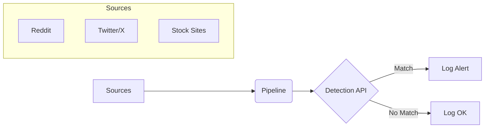

# 🛡️ Digital Asset Protection — Crawler Pipeline

The **scraper** component of the Digital Asset Protection system.

- **Social scraper** — crawls Reddit and Twitter/X for media matching configured keywords, saves to `suspicious/`.
- **Stock scraper** — fetches reference images from Unsplash, Pexels, and Pixabay via their free APIs, saves to `assets/`.

The full pipeline preprocesses media with OpenCV and forwards it to the Detection API.

## 📖 Full Documentation

For architecture, configuration reference, data flow diagrams, module docs, and troubleshooting, see **[DOCS.md](./DOCS.md)**.

## How It Works



The pipeline crawls social and stock sources, processes media via OpenCV, and forwards it to the Detection API for analysis.

## Quick Start

### 1. Install

```bash
python -m venv venv
source venv/bin/activate      # Windows: venv\Scripts\activate
pip install -r requirements.txt
playwright install chromium
```

### 2. Configure

```bash
cp .env.example .env   # then fill in your API keys
```

| Key variable | Description |
|---|---|
| `REDDIT_CLIENT_ID` / `REDDIT_CLIENT_SECRET` | Reddit script app credentials |
| `TWITTER_BEARER_TOKEN` | Twitter API v2 bearer token *(optional — see fallback)* |
| `KEYWORDS` | Comma-separated search terms (e.g. `deepfake,DMCA`) |
| `DETECTION_API_BASE_URL` | Where the Detection API is running |
| `UNSPLASH_ACCESS_KEY` | Free — [unsplash.com/developers](https://unsplash.com/developers) |
| `PEXELS_API_KEY` | Free — [pexels.com/api](https://www.pexels.com/api/) |
| `PIXABAY_API_KEY` | Free — [pixabay.com/api/docs](https://pixabay.com/api/docs/) |

### 3. Run via launcher (recommended)

```bash
# Linux — run from anywhere, venv is activated automatically
./quicklaunch/run.sh

# Windows
quicklaunch\run.bat
```

The launcher provides an interactive menu and **automatically saves timestamped log files** to `logs/`.

```
1) Run Full Pipeline (Regular mode)
2) Run Standalone Scraper (Social or Stock)
3) Run Connectivity Test
4) Install / Update Dependencies (Setup)
5) Clean up Output Folders (assets, suspicious & logs)
6) Exit
```

For option **1 (Full Pipeline)**, the launcher now asks for the source (social/stock), keywords, and max images before starting.

For option **2 (Standalone)**, the launcher first asks for the source (Social or Stock), then proceeds with the respective settings.

### 4. Run via CLI

```bash
# Connectivity test
python main.py --test

# Full pipeline (continuous)
python main.py
python main.py --source stock --keywords "nature" --limit 50

# Social scraper — home mode (Reddit + Twitter, keyword search → suspicious/)
python main.py --standalone --source social
python main.py --standalone --source social --keywords "deepfake,DMCA" --limit 20

# Social scraper — top mode (subreddits + accounts from targets.json)
python main.py --standalone --source social --mode top
python main.py --standalone --source social --mode top --targets targets.json --limit 15

# Stock scraper (Unsplash / Pexels / Pixabay → assets/)
python main.py --standalone --source stock
python main.py --standalone --source stock --keywords "nature,landscape" --limit 10

# Save logs to a file
python main.py --standalone --source social --logfile logs/run.log
```

Stop with **Ctrl+C** — graceful shutdown is handled automatically.

---

## Standalone Modes

### Home mode (default)

Keyword-based search — works exactly like before.

```bash
python main.py --standalone --keywords "sports,deepfake" --limit 20
```

### Top mode

Browses the **top posts** of specific subreddits and the **media timelines** of specific X accounts, without needing keywords. Targets are defined in `targets.json`:

```json
{
  "reddit": {
    "subreddits": ["pics", "sports", "news"],
    "sort": "top",
    "time_filter": "day"
  },
  "twitter": {
    "accounts": ["espn", "Reuters", "NASA"]
  }
}
```

```bash
# Use default targets.json
python main.py --standalone --mode top --limit 10

# Use a custom targets file
python main.py --standalone --mode top --targets my_targets.json
```

Both modes save directly to the `suspicious/` directory and share the same `manifest.json`:

```
suspicious/
├── <sha256>_reddit.jpg
├── <sha256>_twitter.jpg
└── manifest.json
```

Re-runs are **idempotent** — already-saved URLs are skipped automatically.

---

## Stock Scraper (Unsplash / Pexels / Pixabay)

Fetches images from three free stock-image APIs. No Playwright required. Sites whose API key
is missing are skipped gracefully.

```bash
python main.py --standalone --source stock --keywords "nature" --limit 10
```

Saves directly to `assets/`:

```
assets/
├── <sha256>_unsplash.jpg
├── <sha256>_pexels.jpg
├── <sha256>_pixabay.jpg
└── stock_manifest.json
```

---

## Twitter / X Fallback Chain

When no `TWITTER_BEARER_TOKEN` is set, the scraper tries **5 tiers** in order:

| Tier | Source | Notes |
|---|---|---|
| 1 | **Nitter** (21 instances) | Open-source Twitter frontend, no login |
| 2 | **Mastodon** (5 instances) | Federated, public hashtag timelines via REST API |
| 3 | **Bing Images** | Standard image search, no login |
| 4 | **DuckDuckGo Images** | Less bot-hostile than Google |
| 5 | **twitter.com direct** | Last resort; warns if login wall is hit |

---

## Project Structure

```
crawler_pipeline/
├── quicklaunch/
│   ├── run.sh              # Linux interactive launcher (activates venv automatically)
│   └── run.bat             # Windows interactive launcher (activates venv automatically)
├── src/crawler_pipeline/
│   ├── config.py           # All config, reads from .env
│   ├── utils.py            # Logging, SeenCache, MediaItem, retry decorator
│   ├── crawler.py          # Reddit + Twitter crawlers (API + Playwright fallback)
│   ├── fetcher.py          # Async media downloader (aiohttp, 3 retries)
│   ├── preprocessor.py     # OpenCV: resize 256x256, normalize, extract video frames
│   ├── pipeline.py         # Async pipeline orchestrator
│   ├── standalone.py       # Social scraper: Reddit + Twitter → suspicious/
│   └── stock_scraper.py    # Stock scraper: Unsplash / Pexels / Pixabay → assets/
├── logs/                   # Auto-created; timestamped .log files
├── suspicious/             # Auto-created; social images + manifest.json (no subfolders)
├── assets/                 # Auto-created; stock site images + stock_manifest.json (no subfolders)
├── venv/                   # Virtual environment (auto-created by setup option)
├── .env                    # Your secrets (never commit!)
├── .env.example            # Template
├── targets.json            # Top-mode subreddits + X accounts config
├── main.py                 # CLI entry point
└── requirements.txt
```

---

## Key Features

- ✅ **API-first, Playwright fallback** — Reddit and Twitter
- ✅ **Stock image scraper** — Unsplash, Pexels, Pixabay (free JSON APIs)
- ✅ **Flattened structure** — no subfolders in `suspicious/` or `assets/`
- ✅ **Site-name suffix** — `<sha256>_reddit.jpg`, `<sha256>_unsplash.jpg`, etc.
- ✅ **Two social modes** — `home` (keyword search) and `top` (subreddits + accounts)
- ✅ **Twitter 5-tier fallback** — Nitter → Mastodon → Bing → DDG → direct
- ✅ **targets.json config** — edit subreddits and X accounts without touching code
- ✅ **Max images control** — `--limit N` or launcher prompt
- ✅ **Image filtering** — only post-content CDN hosts accepted; icons/banners excluded
- ✅ **Duplicate detection** — SHA-256 URL hash cache with 1-hour TTL
- ✅ **Log files** — all runs tee'd to `logs/<timestamp>_<mode>.log`
- ✅ **Retry logic** — 3 attempts with exponential back-off
- ✅ **Graceful shutdown** — Ctrl+C drains workers cleanly
- ✅ **Config-driven** — everything tunable via `.env`

---

## Requirements

- Python ≥ 3.11
- Reddit app credentials (optional) → [reddit.com/prefs/apps](https://www.reddit.com/prefs/apps)
- Twitter API v2 bearer token (optional) → [developer.twitter.com](https://developer.twitter.com/)
- Unsplash / Pexels / Pixabay API keys (optional, free) → see `.env.example`
- Detection API running on `http://localhost:8000` (for full pipeline mode only)

---

📖 See [DOCS.md](./DOCS.md) for the full reference.
